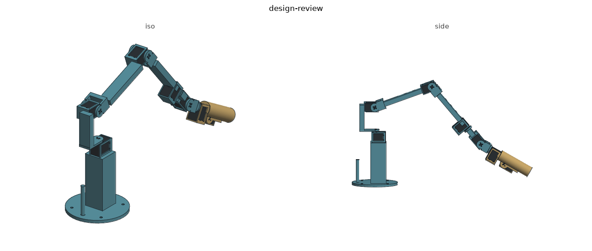

# Gello design review — 5 September 2026

A passive seven-encoder leader for RobotDoctor: six arm joints and a finger trigger. This revision repairs the grip and servo interfaces and raises the base so the home grip clears a full desktop. The host currently previews joint targets and forward kinematics; a hardware follower is not connected.

## Changes made

- Added a 100 mm hollow pedestal. The old home grip extended below desk height, outside the small desktop used by the renderer. The revised home tip is about 33 mm above the desktop. The leader's joint-to-joint dimensions remain unchanged.
- Joined the J6 cradle to the handle using two side cheeks. Previously a 0.5 mm gap split the handle into two disconnected printed solids.
- Cleared the J1 rear idler from the base and the J4 case from the forearm bar. Cutting only the cradle's pocket had left the adjacent bar inside the servo.
- Reoriented the finger lever down the handle, seated its ear directly on the horn, and included trigger rotation in the assembly. Release and intermediate pulls through 40° now clear the grip and servos in the tested home pose.
- Removed the duplicated J1 horn offset in the assembly frame, closing an unmodeled gap between the horn and shoulder.
- Collision checks include all modeled bodies, servos, the handle, trigger and a 1200 × 1000 mm desktop. Export requires one valid connected solid per print.
- Firmware stays in passive encoder mode. The old current-mode "parking hold" applied a signed current without a position target. The `t` command now requests torque-off and reports that parking is unavailable. Calibration is stored on the host; `z` no longer reports a fictitious device zero.

## Geometry and fit

| Dimension | Current CAD |
|---|---:|
| Upper / forearm joint spacing | 160 / 200 mm |
| J1 frame to J2 | 65 mm |
| J1 reference height above desk | 140 mm |
| Base diameter / added riser | 120 / 100 mm |
| Handle length / diameter | 90 / 28 mm |
| Trigger travel | 40° |

The pedestal is part of the base print; retain a clear roof under the servo and inspect bridging in the slicer. Clamp or screw the base to the desk. The modeled peg alone is not a completed counterbalance: there is no validated moving anchor, band route or force curve. Support the leader by hand during fitting.

The seven XL330s are planned, not ordered. All six ordered XC330s belong to the five-finger hand. The servo dimensions, rear support detail and horn/case holes are inherited assumptions; compare a fit coupon to the manufacturer's drawing and the first physical servo before printing the complete set. A cylinder at the rear is an envelope, not proof that the proposed M3 idler fastener is compatible.

The follower arm is being redrawn separately by Fable. Reconcile `cad/params.py` and joint conventions against the completed arm before treating the leader as geometrically matched. Do not infer a usable full joint range from link ratios. Whole-arm and desk collisions depend on every joint; `fold_limit` is a sampled internal-collision diagnostic and explicitly excludes the desk.

## Electronics and software

See [electronics.md](electronics.md) for the unresolved RX level shift, USB current qualification and node bring-up. An ESP32 board, buffer and a USB cable are not yet a validated seven-servo power/interface assembly.

The node is a prototype encoder reader. It rejects short/oversized packet lengths, wrong servo IDs and status errors before exposing positions. Host tests compile the actual sketch with a fake Arduino UART under address and undefined-behaviour sanitizers. They do not validate an ESP32 build, real bus timing, byte stuffing, hardware or servo ID provisioning.

`gello.follow --sim` prints a forward-kinematics preview using RobotDoctor; it does not drive MuJoCo or the physical arm. A future follower needs a separate enable gate, freshness/error handling, measured joint calibration and integration with the arm's supervisor. Do not use this preview as an operating controller.

For calibration, the current reader assumes a hanging zero pose. Support the leader clear of the desk to capture it, or implement a measured supported calibration pose with the appropriate offsets before use. A visual home pose is not a measured zero.

## Validation and print plan

The tests exercise connected geometry, servo pockets, representative whole assemblies, home desk height, trigger sweep, injected nonadjacent obstructions, and firmware packet rejection/torque-off behaviour. They deliberately report collisions for the former low hanging desk pose. They do not establish fit to measured servos or a continuous workspace.

Use PLA for first fit coupons and PETG for the evaluated prototype. Run `python -m tools.materials` for full-solid material equivalents with a separate 20% allowance; these supersede the old unverified 150 g purchase budget. Slice all copies with supports and subtract measured free stock before buying filament.
